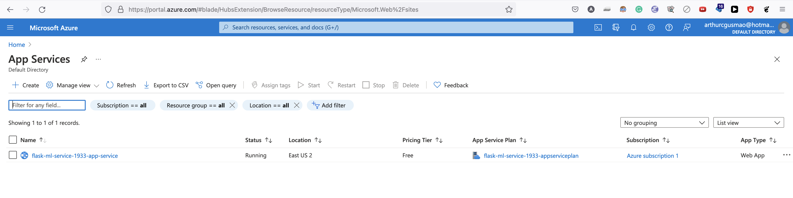

# Project 2 - Udacity Azure DevOps Engineer Nanodegree

In this project, we build a Github repository from scratch and create a scaffolding that will assist you in performing both Continuous Integration and Continuous Delivery. We'll use Github Actions along with a `Makefile`, `requirements.txt` and application code to perform an initial lint, test, and install cycle. We'll also integrate this project with Azure Pipelines to enable Continuous Delivery to Azure App Service.


## Project plan

Below you can find links to our initial project plan and task tracking board:
- [Trello board](https://trello.com/b/nGom8u7k/devops-engineer-project-2)
- [Quarterly plan - Google Sheets](https://docs.google.com/spreadsheets/d/1xu738gRjtE2W-Y7g0yxVfe0bbP9INLvNuagDkJUsia4/edit?usp=sharing)


## Instructions

This project requires Python 3.6. Follow the steps below for a description of how to deploy it on Azure App Service.


### Architectural Diagram

In this section you find a diagram of how the parts of the system work. Our source code is hosted in GitHub. Once it is successfully tested and linted (i.e., the CI part is successfully run), the app is cloned into a build server in Azure Pipelines. There, we build and deploy the application into Azure App Service, the Platform as a Service (PaaS) where our Flask ML API is deployed, with our machine learning model.


### Clone project into Azure Cloud Shell

Clone this project into your Azure Cloud Shell environment by copying the repo's URL (preferably, use the SSH option, which requires you to first have successfully added an SSH key from your Cloud Shell environment into your GitHub account -- see instructions [here](https://docs.github.com/en/authentication/connecting-to-github-with-ssh/adding-a-new-ssh-key-to-your-github-account)).

Below is the command for cloning the repo via SSH:

```bash
git clone git@github.com:arthurcgusmao/udacity-devops-project2.git
```

After which you should be able to see the `udacity-devops-project2` directory in your Cloud Shell and `cd` into it, as shown below:


### Run tests locally

To ensure everything is working correctly, run all commands in the Makefile, which will install the dependencies and then lint and test your source code. A good practice is to only do so inside a virtual environment. You can create a virtual environment by running the following:

```bash
python3 -m venv .venv
```

Next, run the `make all` command of the `Makefile` as described initially:

```bash
make all
```

Which should give you the following output:


### Passing tests on CI (GitHub Actions)

Whenever new commits are added to the main branch of this repo, the CI job hosted in GitHub Actions will be triggered. The YAML file that configures the CI job can be found in `./.github/workflows/pythonapp.yml`.

Should the CI be working correctly, you will see the output below when looking at the "Actions" tab in GitHub:


### Output of a test run

To test the code locally, you can run (inside your virtual environment after `make all` is successful):

```bash
python app.py
```

And then, in another terminal tab, you can make an HTTP request to the ML API with the script `./make_predict.sh`. It should yield the following result:


### Successful deploy of the project in Azure Pipelines

When new commits are pushed to the main branch, there are also CD jobs configured in Azure Pipelines. They will build and deploy our application into Azure App Service. If the deployment process is successful, you should see the following result in Azure Pipelines:

.png)


### Successful prediction from deployed flask app in Azure Cloud Shell.

When the project is successfully deployed on Azure, we can then query the hosted model using the script in `./make_predict_azure_app.sh`. That should yield a correct prediction as shown below:


### Output of streamed log files from deployed application

Logging is an important part of every software project. You can see the logs from the deployed application in Azure with the command:

```bash
az webapp log tail --resource-group flask-ml-service-1933-rg --name flask-ml-service-1933-app-service
```

Which, in turn, should produce the output below:


### Running app

Below you can find a screenshot of the app running on Azure App Service. If all steps before were performed successfully, you should achieve the same output.




### Locust load test

This repo also contains a Locust file (`./locustfile.py`) that allows one to load test the deployed application. The test can be started with:

```bash
locust
```

And then at the URL parameter one should enter `http://flask-ml-service-1933-app-service.azurewebsites.net`. If everything works, you should see the output below.


## Enhancements

The project required to use both GitHub Actions and Azure Pipelines. In the future, we could unify the CI and CD configurations into a single build service, e.g., place everything into Azure Pipelines.

In addition, we could have used IaaS (Infrastructure as a Service), instead of PaaS (Platform as a Service, which is the case of Azure App Service). We could write the Terraform configurations for deploying our ML app in a virtual machine and then packaged it with, e.g., Docker. The benefits of IaaS are its flexibility and lower cost when compared to PaaS.


## Demo

You can find a screencast of this project [here](https://youtu.be/gyXptp5R4cQ).
